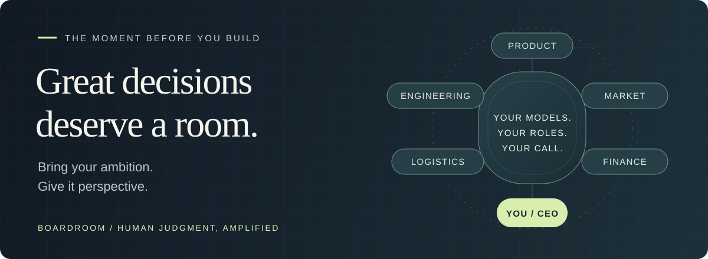

# BOARDROOM

  <strong>A boardroom for the decisions that shape what you build.</strong> 
  Your models. Your experts. Your ambition. You at the head of the table.

  <a href="docs/getting-started.md#try-the-local-example">Try the local example</a> ·
  <a href="docs/live-quickstart.md">Start a live decision</a> ·
  <a href="#a-launch-that-found-its-focus">See the story</a> ·
  <a href="#every-ambition-deserves-its-own-team">Explore the vision</a> ·
  <a href="docs/contributing.md">Build with us</a>

---

## Before the first line of code, there is a decision.

You have an idea you can't leave alone.

You can see the product. You can imagine the launch. You're already thinking about how to build it. Then come the questions that follow you long after you close your laptop.

*Is this the right problem? Can we deliver it? Will anyone care enough to pay?*

For a technical founder, those questions often land on the same desk. Yours. Every assumption can become a feature. Every feature can become weeks of work. And the most consequential choices happen before there is anything to measure.

**Boardroom begins at that moment.**

Our vision is a local decision workspace where **you are the CEO, and you build the team.** Hire the AI models you want, give them the roles your business needs, and bring them your toughest question. Three advisers for a product launch. Five for a new market. Ten for a decision that touches the whole company. You choose who gets a seat.

Bring your context and your ambition. Let your team examine the evidence, challenge the proposal, and work with you toward a plan you can stand behind.

The aim: catch the objection that changes everything while changing your mind is still cheap.

## Every ambition deserves its own team.

A promising idea needs to survive more than one way of looking at the world. The perspectives you need depend on what you're trying to do.

A software launch might call for a Product Owner, a Lead Developer, and a Marketing Manager. Expanding a physical business might call for a logistics expert, a finance director, and someone who understands the local market. Build the room around the decision.

Imagine the people you'd want at the table:

| At the table | The question they bring |
| :--- | :--- |
| **Product Owner** | What is the smallest thing we can build that solves a problem worth solving? |
| **Lead Developer** | What will it take to make this real, and which constraint could break the plan? |
| **Marketing Manager** | Who needs this, how do we reach them, and what evidence says they will pay? |
| **Logistics Expert** | Can we deliver reliably, and where does the supply chain become fragile? |
| **Finance Director** | What can we afford to commit, and which assumptions determine the return? |
| **You, the CEO** | Given the tradeoffs, what are we willing to commit to? |

These are examples of seats you could create. Our ambition is to let you recruit any AI model you want and define its responsibility. The team can grow, shrink, or change expertise with the question.

The intended conversation starts with independent assessments, then brings them into the same room. Advisers challenge specific assumptions, investigate the context, and revise the shared proposal. You can add the missing fact, question an argument, or change the direction.

You choose the models. You define the roles. Evidence gives you something to judge their perspectives against. **The final decision belongs to you.**

## A launch that found its focus

For this story, you've brought together a Product Owner, a Lead Developer, and a Marketing Manager to examine a SaaS launch. The proposal is exciting: **five integrations, self-service billing, four weeks.**

Then the Lead Developer points to one line in the project context: **two engineers.**

That constraint changes the conversation. The Product Owner revises the scope to one integration and a supervised pilot. The Marketing Manager pushes for five design partners before a public launch — and keeps one question open: will they pay?

The ambition now has a first step:

> Run a four-week supervised pilot with one integration and five design partners. Defer self-service billing and public launch.

Excerpt from the <a href="assets/demo/meeting.json">bundled example's plan</a>. This story is a scripted, fictional illustration of the decision process.

Two advisers approve the revised plan. Marketing still reports **insufficient evidence**. That uncertainty stays in the room, right beside the recommendation, where you can act on it.

**You leave knowing what to build first, what changed, and what still needs to be learned.**

<strong>Step inside the example</strong>

An actual terminal capture of the local recorded example. The dialogue and model labels are fictional; playback makes no model calls.

[Read the accessible transcript](docs/demo-transcript.txt) · [Inspect the source context](assets/demo/context.md) · [Capture provenance](docs/media/README.md)

## Leave with a decision you can explain.

Boardroom's design follows a simple path: **question → evidence → challenge → revision → your decision.**

The outcome is a plan and a decision memo: what to do next, why the proposal changed, which evidence mattered, and where disagreement remains. A record you can reopen when circumstances change or someone asks, “Why did we choose this?”

We want that record to make the next conversation better, too. A remembered assumption should still be an assumption. A decision made under one constraint should remain understandable when that constraint disappears.

## What we believe a seat at the table requires

These principles guide the product we are building:

- **Disagreement earns its place.** An objection that survives the discussion belongs in the final memo. Consensus is never required to end a meeting.
- **Evidence stays inspectable.** Claims should lead back to the source version behind them. Missing evidence should remain visible.
- **Human judgment has the final word.** You set the direction and make the call. Adviser confidence cannot overrule you.
- **Access is yours to grant.** Local project memory, explicit permissions, preserved originals, and deliberate spending limits are part of the design. Live advisers will receive selected context through the model providers you configure.

Explore the [founding product specification](boardroom-plans/BOARDROOM_V1_SPEC.md) for the decision process behind this vision, or the [implementation guide](docs/getting-started.md) for what you can run today.

## Bring the question that matters.

*Which feature deserves the next six weeks? Is this architecture worth the complexity? What would we need to learn before committing to this launch?*

Boardroom is for founders, CEOs, and builders who want to assemble the expertise their ambition deserves — and give their decisions the same care they give their product.

**[Explore the local example →](docs/getting-started.md#try-the-local-example)**

Start with a fictional launch, follow the objection, and inspect the resulting plan. Setup and current availability live in the guide.

You can also [prepare your own question locally](docs/preparing-a-question.md): create a project, select text passages, and keep an inspectable snapshot. [Live PO framing](docs/framing-a-question.md) can then propose a framing and await your explicit version-specific approval. The complete adviser debate and decision exports remain under development.

[Call control](docs/controlling-calls.md) freezes protected budgets and time, exposes durable receipts and supports stopping in-flight work. [Explicit paid preflight](docs/provider-preflight.md) supports bounded OpenAI and Anthropic text routes; actual provider/account qualification remains open.

[Configure your advisers and protected credentials](docs/configuring-routes.md) before deliberately authorizing any paid request.

If this is a problem you want to help solve, [build with us](docs/contributing.md). Bring a difficult decision, challenge a product assumption, or help engineer the room.

[Architecture](docs/architecture.md) · [Engineering evidence](docs/plan-01-acceptance.md) · [Development plans](boardroom-plans/00-ORDRE-ET-DEPENDANCES.md) · [Project status](docs/getting-started.md#next-milestones) · [License: Apache-2.0](LICENSE) · [Security](SECURITY.md)

---

<strong>Build something worth believing in. Start with a decision you can stand behind.</strong>

