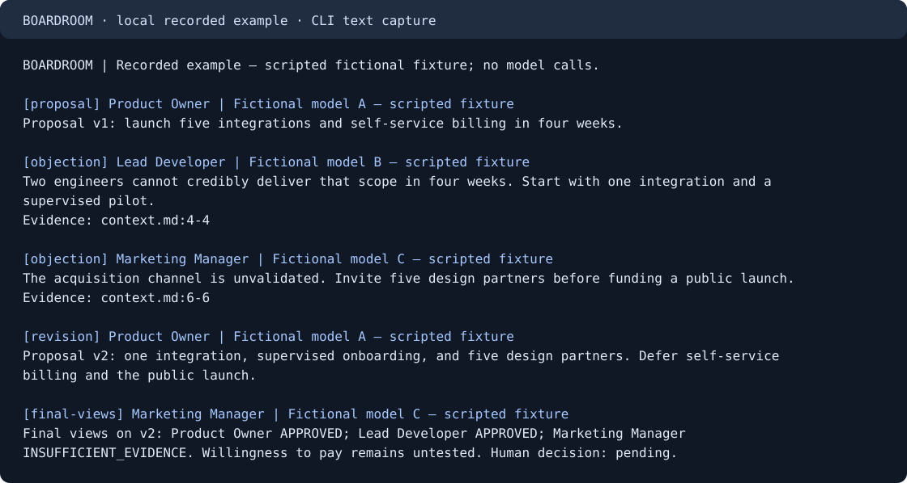

# BOARDROOM

### Make the objection part of the decision.

A local decision workspace for technical founders: a human works with a Product Owner, Lead Developer, and Marketing Manager to turn a proposal into an inspectable plan. Evidence, revised proposals, and unresolved objections stay visible. The human makes the decision.

**Current build: Plan 01 in progress.** You can explore a fictional recorded example, inspect an immutable source revision, export a plan and memo, and reopen your progress. Live AI meetings are planned for the next milestone.

[Try the local example](#try-the-local-example) · [See the discussion](#an-objection-that-changes-the-plan) · [Architecture](docs/architecture.md) · [Validation and remaining work](docs/plan-01-progress.md)

## An objection that changes the plan

The initial proposal is ambitious: five integrations and self-service billing in four weeks. The Lead Developer points to the saved staffing constraint: **two engineers**. The revised plan narrows to one integration and a supervised pilot with five design partners.

The Marketing Manager still reports `INSUFFICIENT_EVIDENCE`: willingness to pay is untested. Two approvals do not erase that uncertainty, and the human decision remains `pending`.

This is a **scripted, fictional recorded example**, authored for the project. Its model labels are fictional; no model generated this recording and no model calls occur during playback.



[Read the complete captured text](docs/demo-transcript.txt) · [Inspect the fictional source](assets/demo/context.md) · [Read the fixture and export content](assets/demo/meeting.json)

## Try the local example

No account, API key, or model download is needed for playback.

### From the development checkout

Prerequisites: **Node 24.12.0**, npm, and the dependencies installed by `npm ci`. The native SQLite driver is required. These commands have been exercised on Windows x64; other platforms await CI and clean-machine qualification.

```sh
npm ci
npm run build
node dist/cli.js demo --data-dir .boardroom/example
node dist/cli.js evidence --line 4 --data-dir .boardroom/example
node dist/cli.js export --output .boardroom/exports --data-dir .boardroom/example
```

Run `demo --next` to read one intervention at a time. Repeating `demo` resumes from the saved position; after the last message it reports `Recording complete`. Use a new `--data-dir` for a fresh example.

### A local candidate with Node included

```sh
npm run package
```

The command prints a new directory under `release/`. It contains its own Node runtime, compiled application, assets, and prepared native dependencies. It builds for the **current host platform and architecture**. It does not produce cross-platform binaries or publish anything.

On Windows, open PowerShell in that printed directory:

```powershell
.\boardroom.cmd demo
.\boardroom.cmd evidence --line 4
.\boardroom.cmd export --output .\exports
.\boardroom.cmd doctor --json
```

The default data directory is `%LOCALAPPDATA%\Boardroom` on Windows, `~/Library/Application Support/Boardroom` on macOS, and `$XDG_DATA_HOME/boardroom` (or `~/.local/share/boardroom`) on Linux. Data remains outside the candidate directory. `--data-dir` overrides this location.

The Windows x64 candidate has been launched with an empty `PATH` from a directory containing spaces and Unicode. A clean machine without Node, macOS, and Linux have **not yet been validated**. There are no published downloads or signed installers yet.

## What happens to your data

- Playback reads only the bundled fictional source. Source ingestion through the application service requires explicit authorization for the chosen file and project.
- Saved citations point to a SHA-256 identified revision. Editing the original does not change that snapshot; inspection warns if the original has changed or disappeared.
- Each export creates a new directory and two UTF-8 Markdown files. Existing plans and sources are preserved.
- Playback makes no provider calls. Commands, MCP, live meetings, and cloud telemetry are unavailable in this build.
- Local files and SQLite databases are readable by the machine owner. Hashes help identify revisions; they are not protection against a malicious machine owner.

When live meetings arrive, selected context will be sent to the configured model providers. Permissions, budgets, and optional observability are later milestones; this recorded build does not validate those capabilities.

## Engineering you can inspect

The terminal renders results; the application service owns state. Domain records, source snapshots, and LangGraph checkpoints have separate storage responsibilities. The recording reader is separate from the tiny LangGraph feasibility probe.

```text
CLI / Ink → Application service → Domain SQLite + immutable snapshots
                │
                └─ New Markdown plan + decision memo

doctor → Separate LangGraph probe → Official SQLite checkpointer
```

TypeScript, Ink/React, Zod, and a pinned `better-sqlite3` driver underpin this first increment. The official checkpointer is retained with its compatible native driver family. See the [architecture and tradeoffs](docs/architecture.md).

```sh
npm run typecheck
npm test
```

Tests exercise public service behavior, real SQLite and files, process restarts, the CLI, Ink rendering, and the candidate with its bundled runtime. Development follows small red → green slices; the [evidence log](docs/plan-01-progress.md) records the observed failures and passing behaviors.

A GitHub Actions workflow is configured for Windows, Linux, and macOS. It has **not been run on a remote repository**; no CI success badge or cross-platform support claim is made.

## Next milestones

Plan 01 still requires document extraction, terminal interaction qualification, protection experiments, further durable contracts, and a three-platform installation campaign. Plan 02 adds the first real decision using three distinct models from at least two providers. [All nine plans](boardroom-plans/00-ORDRE-ET-DEPENDANCES.md) retain their acceptance gates.

The project is currently a development checkout, not a public release. Its project license and release/signing arrangements await a decision. Node's license and dependency licenses accompany the local candidate; they do not select a license for BOARDROOM itself.

To contribute during development, use the approved spec and milestone acceptance criteria, reproduce changes through public interfaces, and start each behavior change with a failing test. Include the relevant validation and update the documentation. No public issue tracker has been configured yet.
