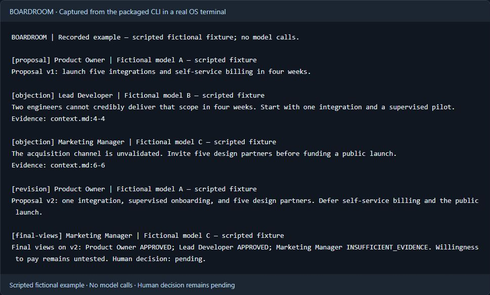

# Explore the local example

[← The Boardroom vision](../README.md)

This guide documents the current implementation, setup, and validation. The README tells the enduring product story.

A local decision workspace for technical founders: a human works with a Product Owner, Lead Developer, and Marketing Manager to turn a proposal into an inspectable plan. Evidence, revised proposals, and unresolved objections stay visible. The human makes the decision.

**Current build: Plan 01 complete; Plan 02 increments 1–6 implemented.** Explore the fictional discussion, immutable text/PDF/DOCX evidence and its exports. You can also [prepare your own question](preparing-a-question.md), [configure routes and protected credentials](configuring-routes.md), [control paid calls](controlling-calls.md), [frame and approve a question](framing-a-question.md), and [obtain three independent analyses](independent-analyses.md). The complete live decision workflow and interactive live terminal remain in progress. Actual provider accounts and the live multi-provider milestone remain unqualified.

[Try the local example](#try-the-local-example) · [See the discussion](#an-objection-that-changes-the-plan) · [Architecture](architecture.md) · [Acceptance evidence](plan-01-acceptance.md)

## An objection that changes the plan

The initial proposal is ambitious: five integrations and self-service billing in four weeks. The Lead Developer points to the saved staffing constraint: **two engineers**. The revised plan narrows to one integration and a supervised pilot with five design partners.

The Marketing Manager still reports `INSUFFICIENT_EVIDENCE`: willingness to pay is untested. Two approvals do not erase that uncertainty, and the human decision remains `pending`.

This is a **scripted, fictional recorded example**, authored for the project. Its model labels are fictional; no model generated this recording and no model calls occur during playback.



This is the rendered screen from an actual packaged CLI process in an OS pseudoterminal. [Replayable VT recording](media/recorded-example.cast) · [Accessible screen text](media/terminal-screen.txt) · [Capture provenance](media/README.md).

[Read the complete captured text](demo-transcript.txt) · [Inspect the fictional source](../assets/demo/context.md) · [Read the fixture and export content](../assets/demo/meeting.json)

## Try the local example

No account, API key, or model download is needed for playback.

### From the development checkout

Prerequisites: **Node 24.12.0**, npm, and the dependencies installed by `npm ci`. The native SQLite driver is required. The recorded workflow and independent installed-candidate journey pass CI on Windows x64, Linux x64, and macOS arm64.

```sh
npm ci
npm run build
node dist/cli.js demo --data-dir .boardroom/example
node dist/cli.js evidence --line 4 --data-dir .boardroom/example
node dist/cli.js export --output .boardroom/exports --data-dir .boardroom/example
node dist/cli.js history --data-dir .boardroom/example
node dist/cli.js decision --data-dir .boardroom/example
```

Run `demo --next` to read one intervention at a time. Repeating `demo` resumes from the saved position; after the last message it reports `Recording complete`. Use a new `--data-dir` for a fresh example.

### A local candidate with Node included

```sh
npm run package
```

The command prints a new directory under `release/`. It contains its own Node runtime, compiled application, assets, and prepared native dependencies. It builds for the **current host platform and architecture**. It does not produce cross-platform binaries or publish anything.

On Windows, open PowerShell in that printed directory:

```powershell
.\boardroom.cmd demo
.\boardroom.cmd evidence --line 4
.\boardroom.cmd export --output .\exports
.\boardroom.cmd history
.\boardroom.cmd decision
.\boardroom.cmd doctor --json
```

On Linux or macOS, open a terminal in the printed directory:

```sh
./boardroom demo
./boardroom evidence --line 4
./boardroom export --output ./exports
./boardroom history
./boardroom decision
./boardroom doctor --json
```

Development archives are retained in the successful [PR 7 workflow runs](https://github.com/francoisnoel62/Boardroom/pull/7/checks). Download the candidate for your OS/architecture and extract `boardroom.tar.gz`; on Unix, use `tar -xzf boardroom.tar.gz` to preserve executable modes. GitHub may require sign-in to retrieve workflow artifacts; the installed application and recorded example require no model account. There is no published product release yet.

The default data directory is `%LOCALAPPDATA%\Boardroom` on Windows, `~/Library/Application Support/Boardroom` on macOS, and `$XDG_DATA_HOME/boardroom` (or `~/.local/share/boardroom`) on Linux. Data remains outside the candidate directory. `--data-dir` overrides this location.

The downloaded candidate passes the [independent installation campaign](installation-qualification.md): fresh Windows/macOS VMs with system/cache application Node removed, and an offline Ubuntu image containing no Node package. The journey uses the bundled runtime, actual launcher, Unicode/space paths and durable data outside the candidate. Signed installers and general release onboarding remain later work.

## Inspect PDF and DOCX evidence

Explicitly authorize the single file you want to read:

```sh
node dist/cli.js document --source assets/validation/launch.pdf --allow-source --data-dir .boardroom/documents
node dist/cli.js document --source assets/validation/launch.docx --allow-source --data-dir .boardroom/documents
```

Each command prints a saved evidence ID. Use that ID to reopen an exact physical PDF page or saved DOCX text block:

```sh
node dist/cli.js evidence --id <pdf-evidence-id> --page 2 --data-dir .boardroom/documents
node dist/cli.js evidence --id <docx-evidence-id> --block 2 --data-dir .boardroom/documents
```

In a Windows candidate, replace `node dist/cli.js` with `.\boardroom.cmd`. Add `--json` for structured output. A failed extraction exits with code `2` and a visible explanation; partial extraction keeps its warnings. PDF page references are physical page numbers. DOCX blocks are saved extraction blocks, **not Word page numbers**. Original bytes and extracted text are saved separately, so later edits do not rewrite a citation.

This increment supports textual PDFs and DOCX text extraction. It does not perform OCR or preserve complex layout, images, and formatting. The [fictional fixtures](../assets/validation/README.md) describe exactly what the automated checks cover. `doctor --json` also extracts those files from the candidate's actual dependencies and assets.

## Try input during a fictional stream

Run this in an interactive terminal:

```sh
node dist/cli.js terminal-check
```

In a Windows candidate, use `.\boardroom.cmd terminal-check`. Type while the sample updates, paste several lines, resize the window, and press Enter to submit the scratch draft. Backspace removes one whole character, including combined accents and emoji. Escape or Ctrl+C cancels with exit code `130` and restores the terminal modes.

The screen is labeled **Technical validation — fictional stream**. Input stays in memory; it does not create project data, advance playback, or call a model. Pasted line endings are normalized, and terminal control bytes are removed before display. Piped input is refused. This is a small input probe, not a live meeting or a full text editor.

## What happens to your data

For separate technical evidence, `trace --output <directory>` creates a new local JSON file with allowlisted event metadata: sequence, type, time, playback position or export-operation ID. It excludes paths, source/transcript bodies and receipts. Nothing is uploaded. `isolation-check --output <directory>` measures fixed fictional temporary targets and loopback networking, then writes a report; it accepts no arbitrary command or MCP endpoint. Both commands support `--json`.

`doctor --json` explains optional blocks. No embedding runtime/model assets or provider/cloud-trace account is configured in this build. FTS5 and local filtered traces remain available; real streaming must be validated in Plan 02. See the [technical qualification report](technical-qualification.md).

- Playback reads only the bundled fictional source. Source ingestion through the application service requires explicit authorization for the chosen file and project.
- Saved citations point to a SHA-256 identified revision. Editing the original does not change that snapshot; inspection warns if the original has changed or disappeared.
- Each export creates a new directory and two UTF-8 Markdown files. Existing plans and sources are preserved.
- `history` shows saved playback events and export outcomes. Each export has a stable ID and receipts containing the paths and SHA-256 hashes of files successfully written. Add `--json` for structured history.
- `decision` inspects the saved context and both proposal versions. Each adviser view references its context/proposal versions; two approvals preserve the remaining `INSUFFICIENT_EVIDENCE` and the pending human decision. Add `--json` for versioned records.
- An export without a saved outcome remains `unconfirmed`, including while it is running. Inspect its directory before requesting a new export. Reopening or reading history never retries it. A failed export may leave partial files; its receipt records the writes that finished.
- Playback makes no provider calls. Commands, MCP, live meetings, and cloud telemetry are unavailable in this build.
- Local files and SQLite databases are readable by the machine owner. Hashes help identify revisions; they are not protection against a malicious machine owner.

When live meetings arrive, selected context will be sent to the configured model providers. Permissions, budgets, and optional observability are later milestones; this recorded build does not validate those capabilities.

## Engineering you can inspect

The terminal renders results; the application service owns state. Domain records, source snapshots, and LangGraph checkpoints have separate storage responsibilities. The recording reader is separate from the tiny LangGraph feasibility probe.

```text
CLI / Ink → Application service → Domain SQLite + immutable snapshots
                │
                └─ New Markdown plan + decision memo

doctor → Separate LangGraph probe → Official SQLite checkpointer
```

TypeScript, Ink/React, Zod, and a pinned `better-sqlite3` driver underpin this first increment. The official checkpointer is retained with its compatible native driver family. See the [architecture and tradeoffs](architecture.md).

```sh
npm run typecheck
npm test
```

Tests exercise public service behavior, real SQLite and files, process restarts, the CLI, Ink rendering, and the candidate with its bundled runtime. Development follows small red → green slices; the [evidence log](plan-01-progress.md) records the observed failures and passing behaviors.

A GitHub Actions workflow runs 53 deterministic integration/E2E tests, including the installers against a local release, and packages candidates on Windows x64, Linux x64, and macOS arm64. Distinct jobs download those archives and run the installed journey without application Node preinstalled. [Plan 01 acceptance evidence](plan-01-acceptance.md) records the observed results, optional blocks and limits. Process interruption, concurrent readers and real OS PTYs are covered; comprehensive recovery and tool isolation remain later milestones.

## Next milestones

Plan 02 adds the first real decision using three distinct models from at least two providers. Its first increment already saves real projects and frozen questions; the [ten-PR plan](../boardroom-plans/02-PLAN-IMPLEMENTATION-EN-10-PR.md) covers connections, spending controls and debate. Later milestones add live participation, incident recovery, retrieval, protected tools and guided onboarding. Optional embeddings are not attempted, while provider streaming and cloud traces remain unavailable. [All nine plans](../boardroom-plans/00-ORDRE-ET-DEPENDANCES.md) retain their own acceptance gates.

The project is currently a development checkout, not a public release. BOARDROOM is licensed under the [Apache License 2.0](../LICENSE); release and signing arrangements await later decisions. Node's license and dependency licenses accompany the local candidate; they do not select a license for BOARDROOM itself.

To contribute during development, use the approved spec and milestone acceptance criteria, reproduce changes through public interfaces, and start each behavior change with a failing test. Include the relevant validation and update the documentation. See the [small dependent PR workflow](contributing.md) used on the [public repository](https://github.com/francoisnoel62/Boardroom).

